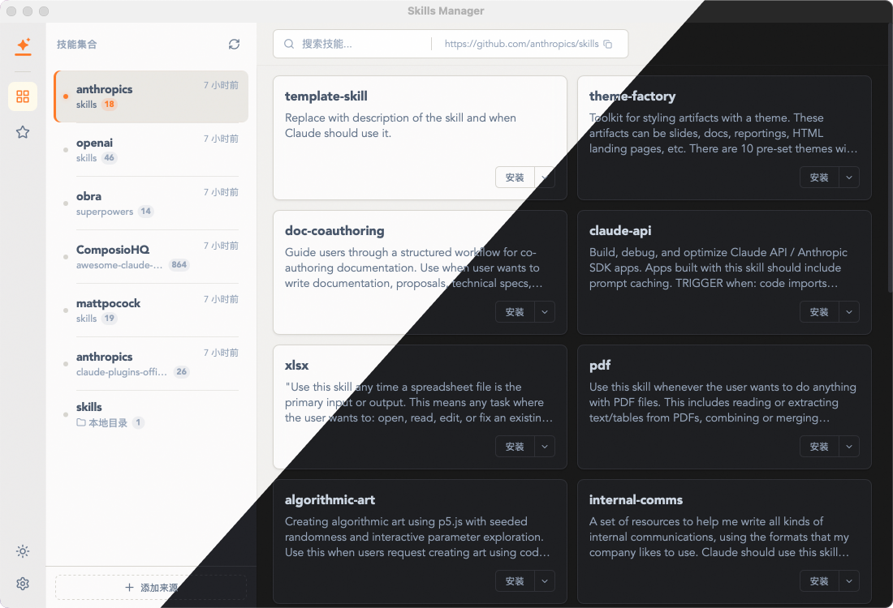

# Skills Manager



一个基于 [Tauri v2](https://v2.tauri.app/) + [Vue 3](https://vuejs.org/) + [TypeScript](https://www.typescriptlang.org/) 构建的桌面应用，用于统一管理 AI 编码工具的技能（插件/规则）。

## 功能特性

- **多工具支持** — 管理以下 AI 编码工具的技能：
  - Claude Code、Cursor、Codex、Opencode、Qoder、Kilo、CodeBuddy、Trae，以及自定义路径
- **仓库管理** — 通过 Git URL 添加远程仓库，或导入本地目录作为技能来源
- **技能浏览与搜索** — 浏览仓库中的技能，支持全局搜索
- **一键安装/卸载** — 通过文件系统 Junction 将技能安装到目标工具目录，支持全局和项目级别
- **收藏** — 收藏常用技能，快速访问
- **自动更新** — 批量拉取仓库最新内容，保持技能同步
- **亮色/暗色主题** — 跟随系统或手动切换

## 技术栈

| 层 | 技术 |
|---|---|
| 前端 | Vue 3、TypeScript、Vue Router、Lucide Icons |
| 后端 | Rust、Tauri v2 |
| 构建 | Vite、pnpm |

## 开发

```bash
# 安装依赖
pnpm install

# 开发模式（Vite 开发服务器运行在 1420 端口）
pnpm dev

# 以开发模式运行 Tauri 桌面应用
pnpm tauri dev

# 前端类型检查
vue-tsc --noEmit

# Rust 编译检查
cargo check --manifest-path src-tauri/Cargo.toml

# 运行 Rust 测试
cargo test --manifest-path src-tauri/Cargo.toml
```

## 构建

```bash
pnpm tauri build
```

## 项目结构

```
src/                        # Vue 3 前端
  types/index.ts            # 共享 TypeScript 类型定义
  composables/              # Vue 组合式函数（状态管理）
  components/               # Vue SFC 组件
  utils/                    # 纯工具函数

src-tauri/src/              # Rust 后端
  main.rs                   # 入口
  lib.rs                    # Tauri 命令注册
  commands/                 # Tauri 命令处理（配置、仓库、技能、安装）
  models/                   # Serde 数据模型
  utils/                    # 路径、Git、Junction 等工具函数

shared/                     # 前后端共享资源
  tools.json                # 工具路径定义
```

## 推荐开发环境

- [VS Code](https://code.visualstudio.com/) + [Vue - Official](https://marketplace.visualstudio.com/items?itemName=Vue.volar) + [Tauri](https://marketplace.visualstudio.com/items?itemName=tauri-apps.tauri-vscode) + [rust-analyzer](https://marketplace.visualstudio.com/items?itemName=rust-lang.rust-analyzer)
